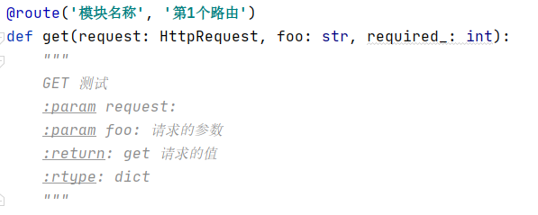
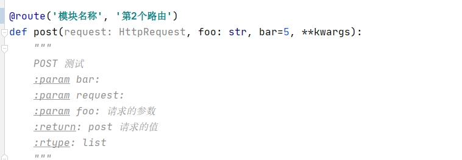
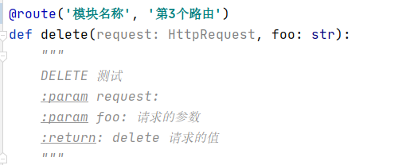
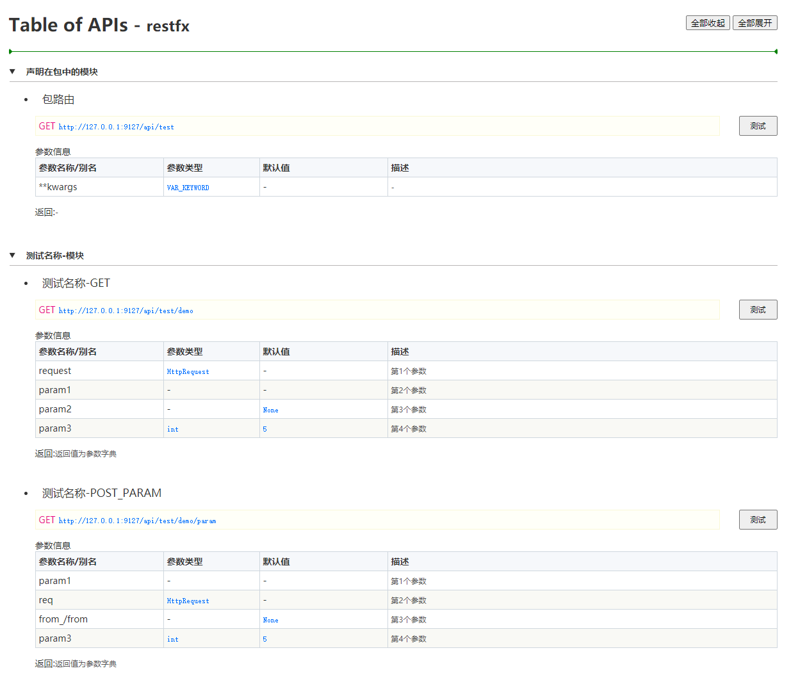
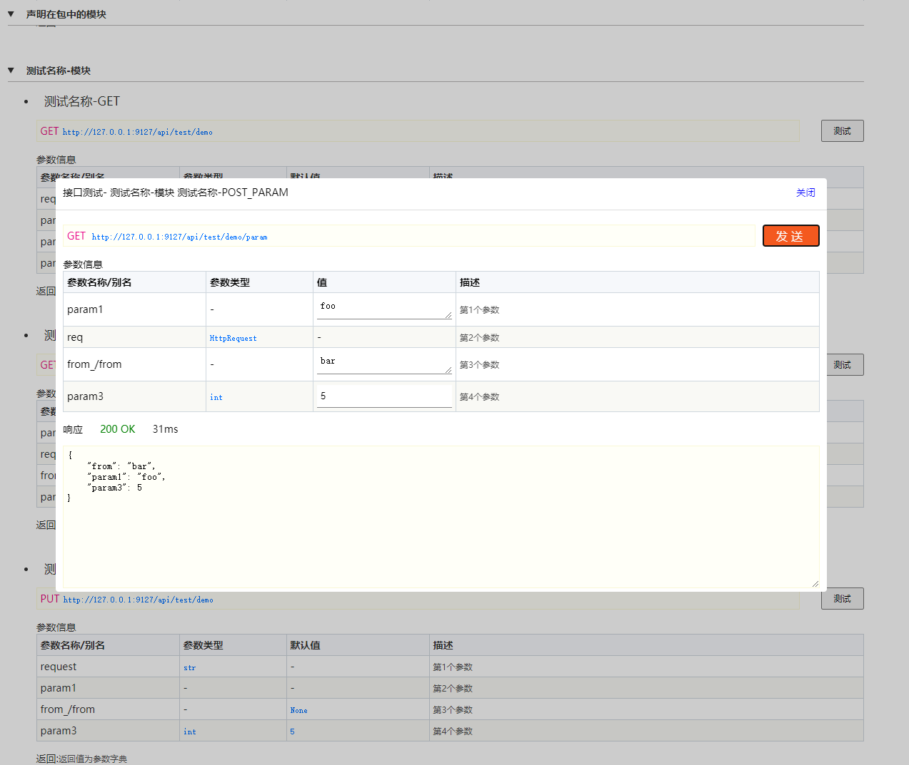
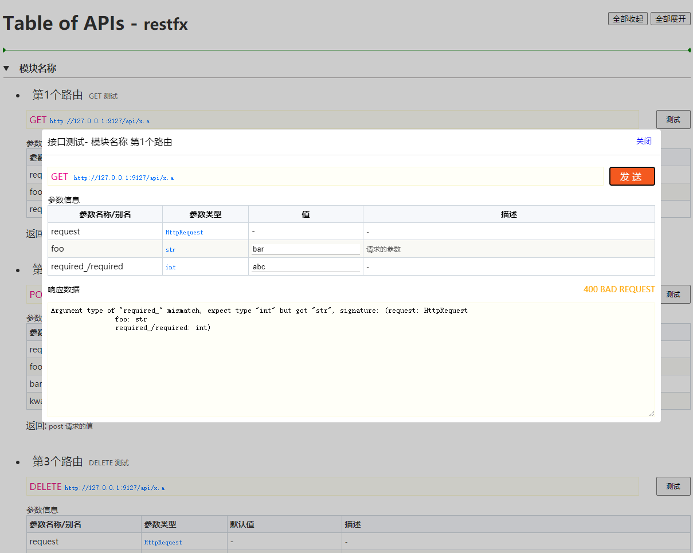

# restfx

Python3 的 restful 多应用自动路由框架。

此包解决的问题：

- 没有繁锁的路由配置
- 便捷的 restful 编码体验
- 自动解析/校验请求参数，并填充到路由处理函数`

## 安装

- Gitee: https://gitee.com/hyjiacan/restfx
- Github: https://github.com/hyjiacan/restfx
- PyPI: https://pypi.org/project/restfx/ 

```shell script
pip install restfx
```

## 使用

此组件提供的包（package）名称为 `restfx`，所有用到的模块都在此包下引入。

### 创建应用

```python
import os

import restfx

if __name__ == '__main__':
    root = os.path.dirname(__file__)
    app = restfx.App(root, api_prefix='any/prefix', debug_mode=True, static_map={})
    app.map_routes({
        'x': 'test'
    })
    app.startup(host='127.0.0.1', port=9127, **kwargs)
```

- `api_prefix` 用于指定 api 接口 url 的根路径，即所有接口都是以此项指定的值开始(默认值为 `api`)。
- `static_map` 用于指定静态资源与目录映射关系。

如：http://127.0.0.1:8000/any/prefix 。

> 多应用模式：每次调用 `restfx.App(...)` 都会启动一个新的应用服务器。
> 每个应用中的路由/中间件等都是独立的。

`app.startup` 有一个参数 `kwargs`，
其可选的参数见 [werkzeug.serving.run_simple][1]

[1]: https://werkzeug.palletsprojects.com/en/1.0.x/serving/?highlight=run_simple#werkzeug.serving.run_simple

### 编写路由

模块 `test.a` -> 文件 `test/a.py` 

```python
from restfx import route
from enums import RouteTypes

@route('module_name', 'route_name', route_type = RouteTypes.TEST)
def get(req):
    pass
```

装饰器 [@route](#装饰器) 用于标记路由处理函数。`RouteTypes` 是自定义的路由数据(可选项)。

`restfx` 包含以下几个部分：

- 路由映射
    
    > 为了避免在客户端暴露代码路径，从设计上使用了映射的方式来处理请求。
- [中间件](#注册中间件)
    
    > 在处理请求/响应过程中，可以对 `request`/`response` 以及其参数进行处理。
- [全局类型](#注册全局类型)
    
    > 在路由装饰器的参数中包含的全局类型，如 `RouteTypes`
- [路由收集与持久化](#发布)
    
    > 为了提高线上性能的工具。

`restfx` 的使用流程如下：

1. [注册路由映射](#注册路由映射)
2. [注册中间件](#注册中间件)
3. [编写路由处理函数](#编写路由处理函数)
4. [发布](#发布)

### 注册路由映射

为了避免在客户端暴露代码路径(同时避免意外访问未授权的代码)，从设计上使用了映射的方式来处理请求。

注册方式如下：

```python
app.map_routes({
    'path.prefix': 'path.to',
})
```

- `path.prefix` 为请求的路径
- `path.to` 为请求路径时，应将其定向到的 python 包/模块。

所有的路由目录(顶层，不包含已经映射过目录的子目录)均需要被映射，未在映射表中的路径请求，不会被处理。
`restfx` 会自动查找 包/模块 `path.to` 下的所有路由。

> 路径应为基于项目根目录的相对路径。

### 注册中间件

中间件用于在处理请求/响应过程中，对 `request`/`response` 以及其参数进行处理。

注册方式如下：

```python
from path.to import FooMiddleware
from path.to import BarMiddleware

app.register_middlewares(
    FooMiddleware,
    BarMiddleware,
)
```

当注册了多个中间件时，它们会按被注册的顺序执行。

**注意**： 每一个中间件类型在程序运行期间共享一个实例。

如何开发中间件？参见 [中间件类结构](#中间件类结构)

### 编写路由处理函数

路由文件位置没有要求，只要配置好就可以了。

```python
app.map_routes({
    'test': 'test.api'
})
```

此配置表示，所有请求中以 `test` 开头的地址，都会交由 `test.api` 下的模块进行处理。

使用装饰器 [route](#装饰器) 标记路由处理函数。

*test/api/demo.py*

```python
from restfx import route
from restfx.http import HttpRequest 

@route(module='module-name', name='name')
def get(request, param1, param2=None, param3: int =5):
    # request 会是 HttpRequest
    return {
        'param1': param1, 
        'param2': param2, 
        'param3': param3, 
    }

@route(module='module-name', name='name')
def get_param(param1, req: HttpRequest, from_=None, param3 =5):
    # req 会是 HttpRequest
    return {
        'param1': param1, 
        'from': from_, 
        'param3': param3,
    } 

@route(module='module-name', name='name')
def get_param(request: str, param1, from_=None, param3 =5):
    # request 会是请求参数，参数列表中没有 HttpRequest
    return {
        'request': request,
        'param1': param1, 
        'from': from_, 
        'param3': param3,
    } 

@route(module='module-name', name='name')
def get_param(request, param1, from_=None, param3 =5, **kwargs):
    # 未在函数的参数列表中声明的请求参数，会出现在 kwargs 中
    return {
        'param1': param1,
        'from': from_,
        'param3': param3,
        'variable_args': kwargs
    }

```

一些需要注意的地方：

- 当代码中需要使用关键字作为名称时，请在名称后添加 `_`，此时前端请求时，`_` 符号可省略，
如: `from_` 在请求时可写作 `from=test` （`from_=test` 亦可）。
- 对于语言间的命令差异，可以自动兼容 `下划线命名法` 与 `驼峰命名法`，如：请求参数中的 `pageIndex`，在处理函数中可以写作 `page_index`或`_page_index_` ，
也就是说，在前后添加 `_` 符号都不会影响参数的解析。
- 路由处理函数可以添加一个可变参数(如：`**kwargs**`)，用于接收未在参数列表中列出的请求项。
当然，`kwargs`和普通函数一样，可以是任何其它名称。
- `request` 参数(与参数位置无关)，可能被解析成三种结果(`1`和`2`均会将其作为 `HttpRequest` 参数处理)：
    1. 参数名称为 `request`，并且未指定参数类型(或指定类型为 `HttpRequest`)
    2. 参数类型为 `HttpRequest`，参数名称可以是任何合法的标识符
    3. 参数名称为 `request`，声明了不是 `HttpRequest` 的类型，此时会被解析成一般的请求参数
    

前端调用:

```javascript
// 请求 get 函数
ajax.get('test.demo?param1=1&param2=2&param3=3')

// 请求 get_param 函数
ajax.get('test.demo/param?param1=1&param2=2&param3=3')
```

路由可以返回任何类型的数据。路由会自动根据函数定义来判断传入参数的类型是否合法。

比如前面示例中的 `param3: int =5`，会根据声明类型 `int` 去判断传入类型
- 如果传入了字符串类型的数值，路由会自动转换成数值类型
- 另外，如果设置了 `None` 以外的默认值，那么路由会根据默认值的类型自动去判断，
此时可以省略参数类型，如: `param3: int =5` 省略为 `param3=5`

### 装饰器

装饰器 `route` 用于声明某个函数可以被路由使用。通过添加此装饰器以限制非路由函数被非法访问。

声明为：

```python
def route(module=None, name=None, **kwargs):
    pass
```

- `module` 此路由所属的业务/功能模块名称
- `name` 此路由的名称
- `**kwargs` *额外参数*

> 这些参数都会被传递给中间件的各个函数的参数 `meta`。详细见 [RouteMeta](#RouteMeta)

同时，此装饰器会自动尝试将 `request.data`，`request.args` 和 `request.form`
处理成 JSON 格式(仅在 `content-type=application/json` 时)，
并且分别添加到 `request.BODY`，`request.GET` 和 `request.POST` 属性上。

注意：一般情况下，使用路由处理函数就能完全操作请求参数，应该尽量减少使用 `BODY/POST/GET`，以避免代码的不明确性。

### session

框架提供了简单的 session 支持。

需要在创建 App 时指定 session 数据源，若不指定时，不启用 session 支持。

```python
from restfx import App
from restfx.session.providers import MemorySessionProvider
app = App(..., session_provider=MemorySessionProvider(20))
```

内置了以下几种数据源:

- `MemorySessionProvider` 基于内存的 session 实现，_在使用多进程模型时，请勿使用此类型_
- `FileSessionProvider` 基于文件的 session 实现
- `MysqlSessionProvider` 基于 mysql 数据库的 session 实现

也可以自定义数据源的实现：

```python
from restfx.session.interfaces import ISessionProvider, IDbSessionProvider

class CustomSessionProvider(ISessionProvider):
    pass

class CustomDbSessionProvider(IDbSessionProvider):
    pass
```

接口 `ISessionProvider` 和 `IDbSessionProvider` 实现其中一个即可。

对于自定义的数据库源，建议使用 `IDbSessionProvider`。

`IDbSessionProvider` 中使用了 `DBUtils` 包中的 [PooledDB](https://webwareforpython.github.io/DBUtils/main.html#id3)。

在初始化时，应该传入一个 `PooledDB` 实例。
在使用时，应该通过 `self.connect(shared=True)` 获取新的连接。

在应用内，可以通过 `request.session` 来访问 session 对象。

```python
from restfx import route
from restfx.http import HttpRequest
@route('test', 'test')
def get(request: HttpRequest):
    session = request.session
    
```

## 发布 

**发布** 指将 `restfx` 项目发布到服务器上运行(线上环境)。

一般来说，发布时只需要调用 [生成路由映射文件](#生成路由映射文件) 的接口就可以了，
路由收集在其中会自动调用。

### 路由收集

路由收集器用于收集项目中的所有路由，通过以下方式调用:

```python
routes = app.collect()
```

> `routes` 是一个可以直接迭代的路由数组

其每一个路由项的结构如下:

- module
- name
- kwargs
- id
- pkg # 路由所在包名称
- file # 路由所在文件的完整路径
- handler # 路由请求的处理函数
- method # 路由的请求方法
- path # 路由的请求路径

### 生成路由映射文件

`restfx` 导出了一个工具函数 `persist`，用于将路由收集起来，并持久化，其用法如下：

```python
import os

restfx_map = os.path.join(os.path.dirname(__file__), 'path/to/restfx_map.py')
# restfx_map 参数是可选的，当不传时，调用会返回生成的代码内容
# encoding 参数是可选的，默认值为 utf-8。
app.persist(restfx_map, encoding='utf-8')
```

> 此处还需要调用路由的映射注册，以及全局类型注册等。
> 因此，最佳方法就是，将这些注册写一个单独的 python 文件，在启动和发布时均调用即可。

最终生成的路由代码会写入文件 _restfx_map.py_，此文件会暴露一个数据项 `routes`，其中是所有的路由映射。
一般来说，应该在系统启动时 (在主应用的 `urls.py` 文件中) 调用此函数:

```python
from path.to import restfx_map
app.register_routes(restfx_map.routes)
```

综上，**发布以及线上运行流程为**：

1. 发布时调用 `restfx.persist` 生成路由映射文件
2. 程序启动时，判断 `app.DEBUG=False`，执行 `from path.to import restfx_map` 
    并调用 `restfx.register_routes(restfx_map.routes)` 注册路由。

## 高级用法

### 分发前的处理

有的时候，需要在分发前对请求参数进行处理。此时可以使用 `restfx.set_intercepter` 来进行一些预处理。

```python
def dispatch_intercepter(request, entry, name):
    # 可以在此处修改 request 的数据
    # 也可以重新定义 entry 和 name
    return entry, name

app.set_intercepter(dispatch_intercepter)
```

### 注册全局类型

当在路由装饰器参数中使用了自定义的值类型时（比如枚举或类），应该当将其注册到 `restfx`，否则无法正确收集到路由。

例：

*test.py*
```python
from restfx import route
from enums import RouteTypes
@route('module_name', 'route_name', route_type = RouteTypes.TEST)
def test(req):
    pass
```

*enums.py*
```python
from enum import Enum
class RouteTypes(Enum):
    TEST = 1
```

### 注册自定义日志记录器

```python
def my_logger(level: str, message: str, e: Exception):
    pass

app.set_logger(my_logger)
```

其中，`level`表示日志级别，会有以下值：

- debug
- info
- warning
- error

### 中间件类结构

**path.to.MiddlewareClass**

```python
from restfx.routes import RouteMeta
from restfx.middleware import MiddlewareBase
from restfx.http import HttpRequest

class MiddlewareClass(MiddlewareBase):
    """
    路由中间件
    """

    def process_request(self, request: HttpRequest, meta: RouteMeta, **kwargs):
        """
        对 request 对象进行预处理。一般用于请求的数据的解码，此时路由组件尚水进行请求数据的解析(B,P,G 尚不可用)
        :param request:
        :param meta:
        :return: 返回 HttpResponse 以终止请求，返回 False 以停止执行后续的中间件(表示访问未授权)，返回 None 或不返回任何值继续执行后续中间件
        """
        pass

    def process_invoke(self, request: HttpRequest, meta: RouteMeta, **kwargs):
        """
        在路由函数调用前，对其参数等进行处理，此时路由组件已经完成了请求数据的解析(B,P,G 已可用)
        此时可以对解析后的参数进行变更
        :param request:
        :param meta:
        :return: 返回 HttpResponse 以终止请求，返回 False 以停止执行后续的中间件(表示访问未授权)，返回 None 或不返回任何值继续执行后续中间件
        """
        pass

    def process_return(self, request: HttpRequest, meta: RouteMeta, **kwargs):
        """
        在路由函数调用后，对其返回值进行处理
        :param request:
        :param meta:
        :param kwargs: 始终会有一个 'data' 的项，表示返回的原始数据
        :return: 返回 HttpResponse 以终止执行，否则返回新的 return value。当返回 None 时，使用原始的 data
        """
        pass

    def process_response(self, request: HttpRequest, meta: RouteMeta, **kwargs):
        """
        对 response 数据进行预处理。一般用于响应的数据的编码
        :rtype: HttpResponse
        :param meta:
        :param request:
        :param kwargs: 始终会有一个 'response' 的项，表示返回的 HttpResponse
        :return: 应该始终返回一个  HttpResponse，当返回 None 时，使用原始的 response
        """
        pass
```

其调用顺序为:

1. `process_request`
2. `process_invoke`
3. `process_return`
4. `process_response`

其中，`process_request` 和 `process_invoke` 按中间件注册的顺序 **顺序** 执行；
`process_return` 和 `process_response` 按中间件注册的顺序 **倒序** 执行。

#### RouteMeta

路由元数据，中间件中勾子函数的参数 `meta` 结构。

- `id: str` 路由ID，此ID由路由相关信息组合而成
- `module: str` 装饰器上指定的 module 值
- `name: str` 装饰器上指定的 name 值
- `method: str` 路由的请求方法 **大写格式**
- `path: str` 路由的请求路径
- `handler: FunctionType` 路由处理函数对象
- `func_args: OrderedDict` 路由处理函数参数列表
- `kwargs: dict` 装饰器上指定的其它参数

另外，meta 还提供了 `has` 和 `get` 两个方法，其描述如下：

- `has(arg_name)` 判断是否指定了额外参数
- `get(arg_name, default_value=None)` 若存在指定名称的额外参数，则返回值，否则返回指定的默认值

> 额外参数: 除 `name` 和 `module` 外的参数

## 截图

### 路由声明
 






### API列表







## 待办事项

- [ ] 添加严格模式支持。在严格模式下，不允许传入未声明的参数。
- [ ] 参数类型支持上传文件
