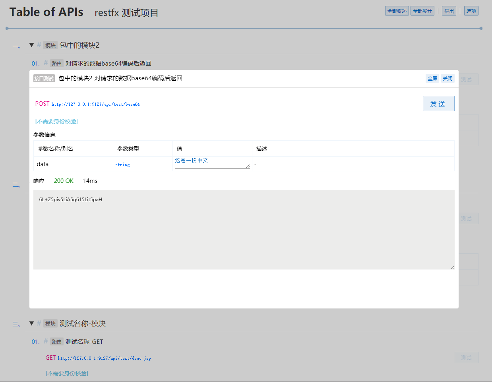

# restfx

Python3 的 restful 多应用自动路由框架。

> 底层基于 [werkzeug](https://werkzeug.palletsprojects.com/)

## 为什么要使用此框架

开发此框架的目标是 **提升开发效率**。

我也曾使用过 **Django**，**Flask**。
但其繁琐的路由注册，以及参数声明，让人难以接受，简单的功能，却要写一大段代码。

此框架的前身是 [restful-dj](https://gitee.com/hyjiacan/restful-dj)，
这是一个为 Django 开发的框架。

在使用中慢慢发现，在 restful 接口上，Django 给了我太多我用不到的东西，
臃肿不堪，于是才决定基于 `werkzeug` 开发。

此框架解决了以下问题：

- 没有繁锁的路由配置，免去路由注册。仅仅需要对模块根进行注册，模块下的所有路由都会自动被收集调用
- 不需要对路由 url 进行显示配置，完全自动解析 
- 自动解析/校验请求参数，并填充到路由函数，省去枯燥的参数获取/校验。需要做的仅仅是编写一个函数，并添加函数参数的类型声明 
- 提供 **接口列表页面** 以及接口测试支持，让接口随码更新，不用手动维护API文档。 见[截图](#截图)
- 提供 [路由注入](#路由注入) 支持，以通过参数方式向路由指定请求参数外的数据/函数，从而避免一些频繁的 `import` 和重复代码

**此框架的弊端: 不支持将参数作为 url 路径的一部分**

## 安装

- Gitee: https://gitee.com/hyjiacan/restfx
- Github: https://github.com/hyjiacan/restfx
- PyPI: https://pypi.org/project/restfx/ 

```shell script
pip install restfx
```

`Since 0.7.1` 安装后，可以通过 CLI 工具 `restfx` 命令创建基本项目结构:

```shell script
restfx create projectname
```

> 使用此命令，可能需要将 `restfx` 安装到全局环境中。

## 使用

此组件提供的包（package）名称为 `restfx`。

此框架遵循 **约定优于编码**，我们的约定如下：

- 路由函数名称均使用 **小写**
- 路由函数名称使用 **下划线风格**
- 路由匹配的就近原则
    当使用url `GET /path/to/route` 的时候，
    如果 `to.py` 和 `route.py` 文件同时存在，
    则会加载 `to.py` 中的 `get_route`，
    而不是 `route.py` 中的 `get`。
- 路由参数名称与 Python 的关键字/保留字/模块名称相同时，在变量名称后添加 `_` 符号
- 注入参数使用 `_` 开头

### 概念

- **应用** 使用 `App()` 初始化得到的实例
- **装饰器** 类型 `restfx.route`，这是一个装饰器 `@route`
- **路由函数** 由装饰器 `@route` 装饰的函数，用于处理请求
- **中间件** 继承 `restfx.middleware.MiddlewareBase` 的类，用于对请求和响应进行自定义处理
- **扩展路由** 一般的路由函数名称为请求的 `method`，如: `get/post`，扩展指具有扩展名称的路由: `get_test/post_test`
- **全局类型** 当在装饰器 `@route()` 的参数中使用的自定义数据类型，需要通过 `app.register_globals()` 进行注册
- **注入** 通过 `app.inject()` 或  `request.inject()` 向路由添加自定义参数 

### 创建应用

```python
import os

import restfx

if __name__ == '__main__':
    root = os.path.dirname(__file__)
    app = restfx.App(root, api_prefix='any/prefix', debug_mode=True)
    app.map_routes({
        'x': 'test'
    }).map_static(static_map={}).startup(host='127.0.0.1', port=9127, **kwargs)
```

- `api_prefix` 用于指定 api 接口 url 的根路径，即所有接口都是以此项指定的值开始(默认值为 `api`)。
    ```
    http://127.0.0.1:8000/any/prefix
    ```
    当启用了 [接口列表页面](#应用的完整参数列表) 时，可以通过以上地址访问接口列表页面，以及对接口进行简单的测试 
- `map_static` 用于指定静态资源与目录映射关系。
  ```python
  import os
  static_map = {
    '/static': os.path.join(root, 'path/to/static')
  }
  ```
  此配置会允许通过url `/static` 访问静态目录 `{root}/path/to/static`。
  指定的静态目录可以是绝对路径，也可以是相对 `root` 的相对路径。

> 多应用模式：每次调用 `restfx.App(...)` 都会启动一个新的应用服务器。
> 每个应用中的路由/中间件等都是独立的。

`app.startup` 有一个参数 `kwargs`，
其可选的参数见 [werkzeug.serving.run_simple][1]

[1]: https://werkzeug.palletsprojects.com/en/1.0.x/serving/#werkzeug.serving.run_simple

应用 `app` 暴露了以下接口:

- `app.startup(host: str, port: int, threaded=True, **kwargs)` 启动调试服务器
- `app.update_debug_mode(debug_mode: bool)->App` 改变当前的 debug 状态
- `app.set_intercepter(intercepter: FunctionType)->App` 指定请求拦截器，其会在分发路由前调用
- `app.set_logger(logger: FunctionType)->App` 指定日志记录函数，不指定时仅仅会在控制台输出日志
- `app.map_routes(routes_map: dict)->App` 指定路由映射表，此表用于重写请求路径
- `app.map_urls(urls_map: dict)->App` 指定 url 映射表，用于使用原始的 url 映射进行处理 `0.7.4`
- `app.map_static(static_map: dict)->App` 指定静态资源映射表，此表用于描述静态资源路径
- `app.register_routes(routes: list)->App` 注册路由列表，此函数应该在线上模式时被调用，
    其参数为通过 persist 生成的文件中的 `routes` 字段
- `app.register(method: str, path: str, handler: FunctionType)->App` 手动注册一个路由
- `app.register_globals(*global_classes)->App` 注册全局类型
- `app.register_middleware(*middlewares)->App` 注册中间件
- `app.collect(*global_classes)->list` 收集路由信息。通过 `register_globals` 指定过的全局类型，此处不用重新指定。
- `app.persist(filename: str = '', encoding='utf8', *global_classes)->str` 获取持久化的路由串(生成的 python 代码)，
    用于写入持久化文件。通过 `register_globals` 指定过的全局类型，此处不用重新指定。
- `app.set_dev_options(**kwargs)->App` 设置一些开发选项。见 [开发选项](#开发选项) 
- `app.inject(**kwargs)->App` 向路由函数注入额外参数。见 [路由注入](#路由注入) 

> `->App` 表示返回了实例本身，也就是说这些接口可以通过链式调用

### 编写路由

模块 `test.a` -> 文件 `test/a.py` 

```python
from restfx import route
from enums import RouteTypes

@route('module_name', 'route_name', route_type = RouteTypes.TEST)
def get(req):
    pass
```

装饰器 [@route](#装饰器) 用于标记路由函数。`RouteTypes` 是自定义的路由数据(可选项)。

`restfx` 包含以下几个部分：

- 路由映射
  
    > 为了避免在客户端暴露代码路径，从设计上使用了映射的方式来处理请求。
- [中间件](#注册中间件)
    > 在处理请求/响应过程中，可以对 `request`/`response` 以及其参数进行处理。
- [全局类型](#注册全局类型)
    > 在路由装饰器的参数中包含的全局类型，如 `RouteTypes`
- [路由收集与持久化](#发布)
    > 为了提高线上性能的工具。

`restfx` 的使用流程如下：

1. [注册路由映射](#注册路由映射)
2. [编写路由函数](#编写路由函数)
3. [注册中间件](#注册中间件)
4. [发布](#发布)

### 注册路由映射

为了避免在客户端暴露代码路径(同时避免意外访问未授权的代码)，从设计上使用了映射的方式来处理请求。

注册方式如下：

```python
app.map_routes({
    'path/prefix': 'path.to',
})
```

- `path/prefix` 为请求的路径
- `path.to` 为请求路径时，框架会将 `prefix` 指定的路径定向到对应的 python 包/模块。

所有的路由目录(顶层，不包含已经映射过目录的子目录)均需要被映射，未在映射表中的路径请求，不会被处理。
`restfx` 会自动查找 `path.to` 包/模块下的所有路由。

> 路径应为基于项目根目录的相对路径。

### 编写路由函数

路由文件位置没有要求，只要配置好就可以了。

```python
app.map_routes({
    'test': 'test.api'
})
```

此配置表示，所有请求中以 `test` 开头的地址，都会交由 `test.api` 下的模块进行处理。

使用装饰器 [route](#装饰器) 标记路由函数。

*test/api/demo.py*

```python
from restfx import route
from restfx.http import HttpRequest


@route(module='测试名称-模块', name='测试名称-GET')
def get(request, param1, param2=None, param3: int = 5):
    # request 会是 HttpRequest
    return {
        'param1': param1,
        'param2': param2,
        'param3': param3,
    }


@route(module='测试名称-模块', name='测试名称-POST_PARAM')
def get_param(param1, req: HttpRequest, from_=None, param3=5):
    # req 会是 HttpRequest
    return {
        'param1': param1,
        'from': from_,
        'param3': param3,
    }


@route(module='测试名称-模块', name='测试名称-PUT_PARAM')
def put(request: str, param1, from_=None, param3=5):
    # request 会是请求参数，参数列表中没有 HttpRequest
    return {
        'request': request,
        'param1': param1,
        'from': from_,
        'param3': param3,
    }


@route(module='测试名称-模块', name='测试名称-DELETE_PARAM')
def delete(request, param1, from_=None, param3=5, **kwargs):
    # 未在函数的参数列表中声明的请求参数，会出现在 kwargs 中
    return {
        'param1': param1,
        'from': from_,
        'param3': param3,
        'variable_args': kwargs
    }

```

一些需要注意的地方：

- 当代码中需要使用关键字作为名称时，请在名称 **后** 添加 `_`，此时前端请求时，`_` 符号可省略，
    如: `from_` 在请求时可写作 `from=test` （`from_=test` 亦可）。
- 对于语言间的命令差异，可以自动兼容 _下划线命名法_ 与 _驼峰命名法_，如：请求参数中的 `pageIndex`，
    路由参数可以写作 `page_index` 或 `page_index_` ，
    也就是说，在路由参数名称后添加 `_` 符号不会影响参数的解析。
- 路由参数 **不要使用 `_` 开头**，因为这会被解析成 [注入参数](#路由注入)。
- 路由函数可以添加一个可变参数(如：`**kwargs**`)，用于接收未在参数列表中列出的请求项。
    当然，`kwargs`和普通函数一样，可以是任何其它名称。
- `request` 参数(与参数位置无关)，可能被解析成三种结果(`1`和`2`均会将其作为 `HttpRequest` 参数处理)：
    1. 参数名称为 `request`，并且未指定参数类型(或指定类型为 `HttpRequest`)
    2. 参数类型为 `HttpRequest`，参数名称可以是任何合法的标识符
    3. 参数名称为 `request`，声明了不是 `HttpRequest` 的类型，此时会被解析成一般的请求参数

URL格式

```
http://127.0.0.1:9127/api/test/demo/param?param1=1&param2=2&param3=3
```

- `127.0.0.1` `startup` 的 `host` 参数
- `9127` `startup` 的 `port` 参数
- `api` `App` 初始化时的 `api_prefix` 参数
- `test/demo` `app.map_routes` 参数中定义的 `'test': 'test.api'`，最终会访问到包 `test.api.demo`
- `/param` `get_param()` 中的 `_param` 名称匹配符扩展路由名称
- `param1/2/3` 分别会填充到处理函数的对应参数中

前端调用

```javascript
// 请求 get 函数
ajax.get('/test/demo?param1=1&param2=2&param3=3')

// 请求 get_param 函数
ajax.get('/test/demo/param?param1=1&from_=2&param3=3')

// 请求 post 函数
ajax.post('/test/demo', {
    param1: 1,
    from_: 2,
    param3: 3
})

// 请求 delete 函数
ajax.delete('/test/demo?param1=1&from_=2&param3=3&param4=4')
```

路由可以返回任何类型的数据。路由会自动根据函数定义来判断传入参数的类型是否合法。

比如前面示例中的 `param3: int =5`，会根据声明类型 `int` 去判断传入类型
- 如果传入了字符串类型的数值，路由会自动转换成数值类型
- 另外，如果设置了 `None` 以外的默认值，那么路由会根据默认值的类型自动去判断，
此时可以省略参数类型，如: `param3: int =5` 省略为 `param3=5`
- `param4` 会出现在 `delete` 请求的 `kwargs` 中

> 在严格模式(`strict_mode=True`)时，若路由函数未指定 `**kwargs` 参数，
> 那么在请求时，只能携带参数列表中声明的参数，否则会收到响应码 `400` 。 

### 装饰器

装饰器 `route` 用于声明某个函数是一个路由函数。通过添加此装饰器以限制非路由函数被非法访问。

声明为：

```python
def route(module=None, name=None, extname=None, **kwargs):
    pass
```

- `module` 此路由所属的业务/功能模块名称
- `name` 此路由的名称
- `extname` 自定义此路由的扩展名 **不要包含 `.` 符号** (可能需要指定响应的 `content-type`) `Since 0.7.4`
- `**kwargs` *用户自定义参数*

> 这些参数都会被传递给中间件的各个函数的参数 `meta`。详细见 [RouteMeta](#RouteMeta)

同时，此装饰器会自动尝试将 `request.data`，`request.args` 和 `request.form`
处理成 JSON 格式(仅在 `content-type=application/json` 时)，
并且分别添加到 `request.BODY`，`request.GET` 和 `request.POST` 属性上。

注意：一般情况下，使用路由函数就能完全操作请求参数，应该尽量减少使用 `BODY/POST/GET`，以避免代码的不明确性。

### 注册中间件

中间件用于在处理请求/响应过程中，对 `request`/`response` 以及其参数进行处理。

注册方式如下：

```python
from path.to import FooMiddleware
from path.to import BarMiddleware

app.register_middlewares(
    FooMiddleware(),
    BarMiddleware(),
)
```

当注册了多个中间件时，它们会按被注册的顺序执行。

**注意**： 注册的是中间件实例，每一个中间件类型在程序运行期间共享一个实例。

如何开发中间件？参见 [中间件类结构](#中间件类结构)

`restfx` 内置了一些中间件，参见 [内置中间件](#内置中间件)

### Session

框架以[中间件](#sessionmiddleware)的方式提供了简单的 session 支持。

```python
from restfx import App
from restfx.session.providers import MemorySessionProvider
app = App(...)
app.register_middleware(MemorySessionProvider(20))
```

若不调用 `app.register_middleware()`，不启用 session 支持。

内置了以下几种数据源:

- `MemorySessionProvider` 基于内存的 session 实现，_在使用多进程模型时，请勿使用此类型_
- `FileSessionProvider` 基于文件的 session 实现
- `MysqlSessionProvider` 基于 mysql 数据库的 session 实现

也可以自定义数据源的实现：

```python
from restfx.session.interfaces import ISessionProvider, IDbSessionProvider

class CustomSessionProvider(ISessionProvider):
    pass

class CustomDbSessionProvider(IDbSessionProvider):
    pass
```

接口 `ISessionProvider` 和 `IDbSessionProvider` 实现其中一个即可。

对于自定义的数据库源，建议使用 `IDbSessionProvider`。

`IDbSessionProvider` 中使用了 `DBUtils` 包中的 [PooledDB](https://webwareforpython.github.io/DBUtils/main.html#id3)。

在初始化时，应该传入一个 `PooledDB` 实例。
在使用时，应该通过 `self.connect(shared=True)` 获取新的连接。

在应用内，可以通过 `request.session` 来访问 session 对象。

```python
from restfx import route
from restfx.http import HttpRequest
@route('test', 'test')
def get(request: HttpRequest):
    session = request.session
    
```

## 发布 

**发布** 指将 `restfx` 项目发布到服务器上运行(线上环境)。

一般来说，发布时只需要调用 [生成路由映射文件](#生成路由映射文件) 的接口就可以了，
路由收集在其中会自动调用。

### 路由收集

> 此功能一般仅用于辅助功能，在开发中若不会显式用到路由列表，不需要调用此函数

路由收集器用于收集项目中的所有路由，通过以下方式调用:

```python
routes = app.collect()
```

> `routes` 是一个可以直接迭代的路由数组

其每一个路由项的结构如下:

- module
- name
- kwargs
- id
- pkg # 路由所在包名称
- file # 路由所在文件的完整路径
- handler # 路由请求的处理函数
- method # 路由的请求方法
- path # 路由的请求路径
- handler_info # 路由函数描述，这些信息从参数和注释收集而来
- is_package # 路由函数是否存在于包 `__init__.py` 文件中
- ext_mode # 是否为扩展路由。扩展路由函数的命名方式为 `get_xxx/post_xxx`

### 生成路由映射文件

`restfx` 导出了一个工具函数 `persist`，用于将路由收集起来，并持久化，其用法如下：

```python
import os

restfx_map = os.path.join(os.path.dirname(__file__), 'path/to/restfx_map.py')
# restfx_map 参数是可选的，当不传时，调用会返回生成的代码内容
# encoding 参数是可选的，默认值为 utf-8。
app.persist(restfx_map, encoding='utf-8')
```

> 此处还需要调用路由的映射注册，以及全局类型注册等。
> 因此，最佳方法就是，将这些注册写一个单独的 python 文件，在启动和发布时均调用即可。

最终生成的路由代码会写入文件 _restfx_map.py_，此文件会暴露一个数据项 `routes`，其中是所有的路由映射。
一般来说，在线上环境中，应该在系统启动时调用此函数:

```python
from path.to import restfx_map
app.register_routes(restfx_map.routes)
```

综上，**发布以及线上运行流程为**：

1. 发布时调用 `restfx.persist` 生成路由映射文件
2. 程序启动时，判断 `app.DEBUG=False`，执行 `from path.to import restfx_map` 
    并调用 `restfx.register_routes(restfx_map.routes)` 注册路由。

## 高级用法

### 应用的完整参数列表

通过 `App(...)` 新建一个应用，此构造接收以下参数:

- `app_id: str` 指定唯一的应用ID
- `app_root: str` 指定应用的根目录
- `api_prefix='api'` 指定API接口的前缀
- `debug_mode=False` 是否启用调试模式
- `append_slash=False` 是否在 url 末尾强制添加 `/`
- `strict_mode=False` 是否启用严格模式 `Since 0.7.5`
- `enable_api_page=None` 是否启用接口列表页面 `Since 0.7.6`

> `enable_api_page` 的值在默认情况下(值为 `None` 时)与 `debug_mode` 一致。 

### 使用路由函数的参数接收文件上传

> `Since 0.7.5`

当需要接收文件上传时，只需要将参数类型指定为 `HttpFile`。

类型 `HttpFile` 需要通过 `restfx.http.HttpFile` 导入。
事实上，这只是 [werkzeug.datastructures.FileStorage][FileStorage] 的一个别名。

```python
from restfx import route
from restfx.http import HttpFile

@route('测试', '测试文件上传')
def post(file: HttpFile):
    pass
```

[FileStorage]: https://werkzeug.palletsprojects.com/en/1.0.x/datastructures/#werkzeug.datastructures.FileStorage

### wsgi

`App` 实例本身即是 `wsgi` 入口。

_main.py_
```python
from restfx import App
# app 就是 wsgi 入口
app = App(...)
```

在部署到 wsgi 容器时，将 `main:app` 暴露给容器作为入口。

### 映射URL

`Since 0.7.4`

在某些情况下，可能会用到更原始的路由映射（比如 url 中的参数支持），而不是使用自动路由，
此时可以使用 `map_urls` 来实现：

```python
from restfx import App
from restfx.http import HttpResponse, HttpRequest
app = App(...)

def test_handler(request: HttpRequest, param: str):
    return HttpResponse('Got param: ' + param)

app.map_urls({
    '/test/<str:param>': test_handler
})
```

此时，可以访问地址 `/test/<str:param>` ，并使用 `test_handler` 来处理请求。

> 注意，路径前的 `/` 符号不可缺少。

> 此处的映射，不会展示在 接口列表中。

### 分发前的处理

有的时候，需要在分发前对请求参数进行处理。此时可以使用 `restfx.set_intercepter` 来进行一些预处理。

```python
def dispatch_intercepter(request, entry):
    # 可以在此处修改 request 的数据
    # 也可以重新定义 entry
    return entry

app.set_intercepter(dispatch_intercepter)
```

### 注册全局类型

当在路由装饰器参数中使用了自定义的值类型时（比如枚举或类），应该当将其注册到 `restfx`，否则无法正确收集到路由。

例：

*test.py*
```python
from restfx import route
from enums import RouteTypes
@route('module_name', 'route_name', route_type = RouteTypes.TEST)
def test(req):
    pass
```

*enums.py*
```python
from enum import Enum
class RouteTypes(Enum):
    TEST = 1
```

### 注册自定义日志记录器

```python
def my_logger(level: str, message: str, e: Exception):
    pass

app.set_logger(my_logger)
```

其中，`level`表示日志级别，会有以下值：

- debug
- info
- warning
- error

### 中间件类结构

**path.to.MiddlewareClass**

```python
from restfx.routes import RouteMeta
from restfx.middleware import MiddlewareBase


class MiddlewareClass(MiddlewareBase):
    """
    路由中间件
    """

    def process_request(self, request, meta, **kwargs):
        """
        对 request 对象进行预处理。一般用于请求的数据的解码，此时路由组件尚水进行请求数据的解析(B,P,G 尚不可用)
        :param request:
        :type request: HttpRequest
        :param meta:
        :type meta: RouteMeta
        :return: 返回 HttpResponse 以终止请求，返回非 None 以停止执行后续的中间件，返回 None 或不返回任何值继续执行后续中间件
        """
        pass

    def process_invoke(self, request, meta, **kwargs):
        """
        在路由函数调用前，对其参数等进行处理，此时路由组件已经完成了请求数据的解析(B,P,G 已可用)
        此时可以对解析后的参数进行变更
        :param request:
        :type request: HttpRequest
        :param meta:
        :type meta: RouteMeta
        :return: 返回 HttpResponse 以终止请求，返回非 None 以停止执行后续的中间件，返回 None 或不返回任何值继续执行后续中间件
        """
        pass

    def process_return(self, request, meta, data, **kwargs):
        """
        在路由函数调用后，对其返回值进行处理
        :param request:
        :type request: HttpRequest
        :param meta:
        :type meta: RouteMeta
        :param data: 表示路由返回的原始数据
        :param kwargs: 保留参数
        :return: 返回 HttpResponse 以终止执行，否则返回新的数据
        """
        pass

    def process_response(self, request, meta, response, **kwargs):
        """
        对 response 数据进行预处理。一般用于响应的数据的编码
        :param request:
        :type request: HttpRequest
        :param meta:
        :type meta: RouteMeta
        :param response: 表示路由返回的原始 HttpResponse
        :type response: HttpResponse
        :param kwargs: 始终会有一个 'response' 的项，
        :return: 返回类型可以是 HttpResponse 或 None(保留原来的 response)
        :rtype: Union[HttpResponse, None]
        """
        pass
```

其调用顺序为:

1. `process_request`
2. `process_invoke`
3. `process_return`
4. `process_response`

其中，`process_request` 和 `process_invoke` 按中间件注册的顺序 **顺序** 执行；
`process_return` 和 `process_response` 按中间件注册的顺序 **倒序** 执行。

在 `process_request` 和 `process_invoke` 中返回了 `HttpResponse` 后，
会中止后续所有中间件执行 `process_request`, `process_invoke`, `process_return`，
并开始执行 `process_response`

在 `process_request` 和 `process_invoke` 中返回了非 `None/HttpResponse` 后，
会中止后续所有中间件执行 `process_request`, `process_invoke`,
并开始执行 `process_return`, `process_response`

在 `process_return` 中返回了 `HttpResponse` 后，会中止持续所有中间件执行 `process_return`，
并开始执行 `process_response`; 返回 `None` 表示不改变返回值(的引用); 返回其它值会作为新的返回值

在 `process_response` 中返回了 `HttpResponse` 后，会中止持续所有中间件执行 `process_response`，
并结束请求。

> 在处理函数中，返回 `None` 不会改变执行顺序。

例如，注册了三个中间件， `MiddlewareA, MiddlewareB, MiddlewareC`，以在 `MiddlewareB` 中为例，
以下是几种会改变中间件执行顺序的情形说明：

- `MiddlewareB.process_request` 返回 **非** `None/HttpResponse` 数据
    - Middleware**A**.process_request
    - Middleware**B**.process_request
    - ~~Middleware**C**.process_request~~
    - ~~Middleware**A**.process_invoke~~
    - ~~Middleware**B**.process_invoke~~
    - ~~Middleware**C**.process_invoke~~
    - Middleware**C**.process_return
    - Middleware**B**.process_return
    - Middleware**A**.process_return
    - Middleware**C**.process_response
    - Middleware**B**.process_response
    - Middleware**A**.process_response
- `MiddlewareB.process_request` 返回 `HttpResponse`
    - Middleware**A**.process_request
    - Middleware**B**.process_request
    - ~~Middleware**C**.process_request~~
    - ~~Middleware**A**.process_invoke~~
    - ~~Middleware**B**.process_invoke~~
    - ~~Middleware**C**.process_invoke~~
    - ~~Middleware**C**.process_return~~
    - ~~Middleware**B**.process_return~~
    - ~~Middleware**A**.process_return~~
    - Middleware**C**.process_response
    - Middleware**B**.process_response
    - Middleware**A**.process_response
- `MiddlewareB.process_invoke` 返回 **非** `None/HttpResponse` 数据
    - Middleware**A**.process_request
    - Middleware**B**.process_request
    - Middleware**C**.process_request
    - Middleware**A**.process_invoke
    - Middleware**B**.process_invoke
    - ~~Middleware**C**.process_invoke~~
    - Middleware**C**.process_return
    - Middleware**B**.process_return
    - Middleware**A**.process_return
    - Middleware**C**.process_response
    - Middleware**B**.process_response
    - Middleware**A**.process_response
- `MiddlewareB.process_invoke` 返回 `HttpResponse`
    - Middleware**A**.process_request
    - Middleware**B**.process_request
    - Middleware**C**.process_request
    - Middleware**A**.process_invoke
    - Middleware**B**.process_invoke
    - ~~Middleware**C**.process_invoke~~
    - ~~Middleware**C**.process_return~~
    - ~~Middleware**B**.process_return~~
    - ~~Middleware**A**.process_return~~
    - Middleware**C**.process_response
    - Middleware**B**.process_response
    - Middleware**A**.process_response
- `MiddlewareB.process_return` 返回 `HttpResponse`
    - Middleware**A**.process_request
    - Middleware**B**.process_request
    - Middleware**C**.process_request
    - Middleware**A**.process_invoke
    - Middleware**B**.process_invoke
    - Middleware**C**.process_invoke
    - Middleware**C**.process_return
    - Middleware**B**.process_return
    - ~~Middleware**A**.process_return~~
    - Middleware**C**.process_response
    - Middleware**B**.process_response
    - Middleware**A**.process_response
- `MiddlewareB.process_response` 返回 `HttpResponse`
    - Middleware**A**.process_request
    - Middleware**B**.process_request
    - Middleware**C**.process_request
    - Middleware**A**.process_invoke
    - Middleware**B**.process_invoke
    - Middleware**C**.process_invoke
    - Middleware**C**.process_return
    - Middleware**B**.process_return
    - Middleware**A**.process_return
    - Middleware**C**.process_response
    - Middleware**B**.process_response
    - ~~Middleware**A**.process_response~~

#### RouteMeta

路由元数据，中间件中勾子函数的参数 `meta` 结构。

- `id: str` 路由ID，此ID由路由相关信息组合而成
- `module: str` 装饰器上指定的 module 值
- `name: str` 装饰器上指定的 name 值
- `extname: str` 装饰器上指定的 extname 值
- `method: str` 路由的请求方法 **大写格式**
- `path: str` 路由的请求路径
- `handler: FunctionType` 路由函数对象
- `func_args: OrderedDict` 路由函数参数列表
- `kwargs: dict` 装饰器上指定的其它参数

另外，meta 还提供了 `has` 和 `get` 两个方法，其描述如下：

- `has(arg_name)` 判断是否指定了额外参数
- `get(arg_name, default_value=None)` 若存在指定名称的额外参数，则返回值，否则返回指定的默认值

> 额外参数: 除 `name` 和 `module` 外的参数

### 内置中间件

#### SessionMiddleware

此中间件用于提供 session 支持。

```python
from restfx import App
from restfx.middleware.middlewares import SessionMiddleware
from restfx.session.providers import MemorySessionProvider

app = App()
app.register_middleware(
    SessionMiddleware(MemorySessionProvider(20),
                 session_name='sessionid',
                 cookie_max_age=None,
                 cookie_expires=None,
                 cookie_path="/",
                 cookie_domain=None,
                 cookie_secure=False,
                 cookie_samesite=None,
                 cookie_httponly=True)
)
```

#### HttpAuthMiddleware

此中间件提供 HTTP 身份校验 `Http Authentication` 支持，其基于 `WWW-Authenticate` 实现。

```python
from restfx import App
from restfx.middleware.middlewares import HttpAuthMiddleware
from restfx.routes import RouteMeta
from restfx.http import HttpRequest

def on_http_auth(request: HttpRequest, meta: RouteMeta):
    if not meta.get('auth', True):
        """
        当 @route 中指定了 auth=False 时，表示此路由不需要身份验证
        auth 为开发者自己定义的名称，并未内置。
        """
        return True
    authorization = request.authorization
    if authorization is not None and authorization.username == 'admin' and authorization.password == '123456':
        return True
    else:
        return False

app = App()
app.register_middleware(
    HttpAuthMiddleware(on_auth = on_http_auth)
)
```

> 一般来说，此中间件应该被第一个注册，以防止越权操作。

### 开发选项

通过 `app.set_dev_options(**kwargs)->App` 设置一些开发选项。

支持的配置项:
 
- `app_name: str` 在 接口列表上展示的应用名称。
- `api_list_addition: FunctionType` 指定接口列表的附加项。一般用于展示一些自定义的路由字段。
- `api_list_expanded: bool` 在接口列表加载后，是否默认展开所有项。

#### api_list_addition

用于自定义接口列表中的附加信息渲染。其声明如下：

```python
def api_list_addition(route_info):
    pass
```

其返回值将作为附加信息（支持使用 html）。

此功能一般在 `@route` 上有自定义的参数时，给用户提示使用，如：

```python
from restfx import App, route

def api_list_addition(route_info):
    if 'auth' not in route_info['kwargs'] or route_info['kwargs']['auth'] is False:
        return '<span style="color: #ff7d7d">[需要身份校验]</span>'
    return '<span style="color: #66c0de">[不需要身份校验]</span>'


App(...).set_dev_options(api_list_addition=api_list_addition)

@route('module', 'name', auth=False)
def get():
    pass
```

以上代码演示了在装饰器 `@route` 上添加了自定义参数 `auth`，用于表示接口是否需要校验。

### 路由注入

`Since 0.7.6`

**路由注入** 用于路由函数注入一些额外的数据/函数作为参数，以简化某些频繁的操作。

未使用注入：

```python
from restfx import route, App
from foo import bar
from glob import config

app = App(...)

@route()
def get(request):
    action = config.foobar
    bar.test(request)
```

使用注入:

```python
from restfx import route, App
from restfx.middleware import MiddlewareBase
from foo import bar
from glob import config

class MiddlewareFoo(MiddlewareBase):
    def process_request(self, request, meta, **kwargs):
        request.inject(test=bar.test)

app = App(...)
app.inject(config=config)
app.register_middleware(MiddlewareFoo())

@route()
def get(_config, _test):
    action = _config.foobar
    # test 的参数可以在中间件中就填写，不再需要在路由函数中填写了 
    _test()
```

为了方便地表示路由函数的某个参数是一个 **注入参数**，在此框架中，约定：

若某个路由函数的参数名称是以下划线开头 `_foobar` ，那么就认为这是一个注入参数。
其可以是一个数据项，也可以是函数或其它任意类型。
需要注意的是，在调用 `app.inject` 或 `request.inject` 时，指定这些注入的名称不需要 `_` 头，
仅仅在路由函数中声明时需要。

```python
# 注入时使用 test
app.inject(test=test.bar)

# 声明参数时使用 _test
@route
def get(_test):
    pass
```

在路由函数中，注入参数的声明是可选的，
也就是说，这些参数是按需声明的。

路由注入有两个途径：

- 全局注入 指通过 `app.inject()` 注入，这种注入一般是一些全局的东西，也就是与具体的某个请求无关
- 请求注入 在中间件的 `process_request` 方法中，调用 `request.inject()` 注入，这种注入一般都与 `request` 的数据有关。

## 截图

以下截图为接口列表，对应的路由声明源码见

- [test/test/api/__init__.py](test/test/api/__init__.py)
- [test/test/api/demo.py](test/test/api/demo.py)




## 待办事项

无
